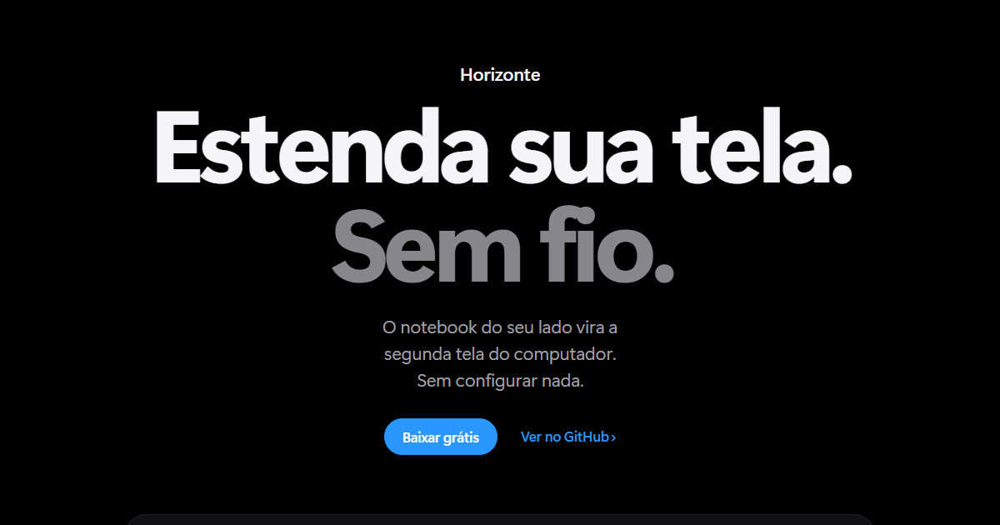

# Horizonte

**Estenda sua tela. Sem fio.**

O notebook do seu lado vira a segunda tela do computador, sem configurar nada. Gratuito e de código aberto.



**Site:** https://mapompeo.github.io/horizonte/

## Baixar

A versão mais recente fica em [Releases](https://github.com/mapompeo/horizonte/releases).

| Sistema | Arquivo | Estado |
|---|---|---|
| Windows 10 e 11 | `Horizonte-<versão>-setup.exe` | Disponível |
| Linux (Ubuntu) | `.AppImage` ou `.deb` | Envia e recebe; em teste |
| macOS (chip Apple e Intel) | `.dmg` | Envia (com monitor virtual próprio) e recebe; em teste |

O instalador ainda não é assinado. No Windows aparece "O Windows protegeu o computador": clique em Mais informações e depois em Executar assim mesmo.

No Mac, o primeiro "Abrir" pode ser recusado ("danificado" ou "desenvolvedor não identificado"). Arraste o Horizonte para Aplicativos e rode uma vez no Terminal: `xattr -cr /Applications/Horizonte.app`. Depois abra normalmente. Para enviar a tela, o macOS pede a permissão de Gravação de Tela na primeira vez.

## Como funciona

1. Instale nos dois computadores.
2. Em um, escolha Enviar. No outro, Mostrar.
3. Clique em Estender.

Por baixo, o Horizonte instala e configura o [Sunshine](https://github.com/LizardByte/Sunshine), o [Moonlight](https://github.com/moonlight-stream/moonlight-qt) e o [Virtual Display Driver](https://github.com/VirtualDrivers/Virtual-Display-Driver). Tudo fica na sua rede local, sem conta e sem nuvem.

## Desenvolver

O app fica em `app/` (Electron, Svelte e TypeScript):

```bash
cd app
npm install
npm run dev
npm test
```

O site fica em `site/` (HTML, CSS e JavaScript, sem build):

```bash
cd site
npm test
```

## Licença

GPL-3.0-or-later.
